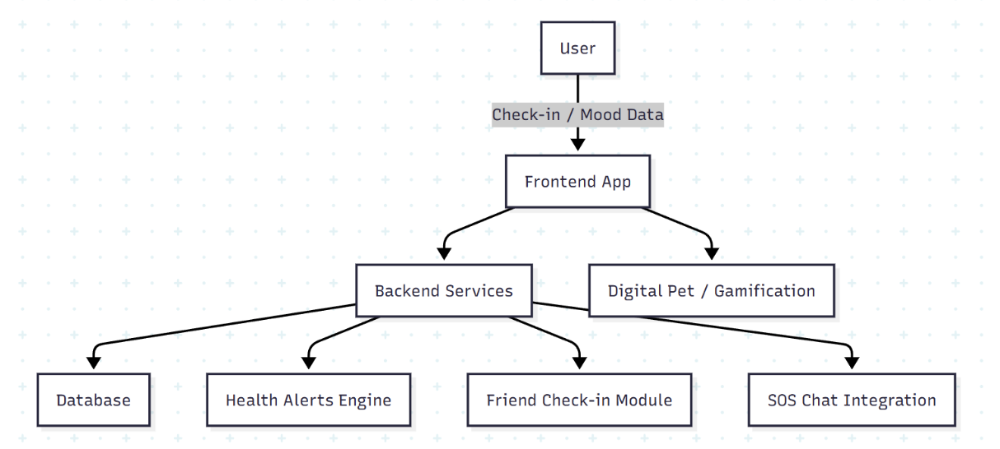

## Problem Statement

Youths in Singapore face growing mental health challenges but lack accessible and effective outlets to manage and cope with these issues.

### Background
- YEAR Study by NUS (MOH, 2024): ~1 in 3 youths (10–18) experience depression, anxiety, or loneliness.  
- NPHS 2023: ~1 in 4 youths (18–29) reported poor mental health.  
- Awareness of mental health conditions has improved, and stigma has reduced, but youths still struggle to access early intervention and coping outlets.

### Key Challenges
- Difficulty identifying when professional help is needed.  
- Difficulty finding accessible mental health resources and outlets.

---

## Solution Overview

**Core Solution:**  
A **digital buddy mascot** that guides users through their mental wellbeing journey, providing empathy and personalized support.

### Features
- Engaging mascot that encourages interaction and lets users play or "fidget" with it.  
- Regular check-ins tracking sleep, exercise, school/work hours.  
- Quick questionnaires to calculate a mood score.  
- Stimulated integration with wearables (Apple Watch, Fitbit) in databsase  
- Integration with mental health hotlines: SOS, IMH Helpline, Care Corner, OverTheRainbow.  
- Social support: add friends, share encouragement, and check each other’s moods.

### Tech Stack
- **Database:** Supabase  
- **Backend:** Python, Node.js  
- **Frontend:** JavaScript, Vue.js   

---

## Solution Impact

**Early Detection & Support:**  
Check-ins and wellbeing tracking allow users to monitor trends before crises occur. Health tracker alerts, friend notifications, and SOS integration provide immediate assistance.

**Unique Selling Points (USP):**  
- **Stigma-Free:** Digital pet reduces barriers to mental health engagement.  
- **Proactive Intervention:** Early detection via mood trends and wearable metrics.  
- **Integrated Support Network:** Friends and crisis chat for holistic support.  
- **Engagement & Comfort:** Gamified interactions encourage consistent use.

**KPIs:**  
- User Engagement: % of users completing check-ins weekly & average interaction per user.  
- Early Intervention: reduction in users reporting crisis-level stress before seeking help.  
- Support Access: friend alerts triggered & % of users accessing SOS chat.  
- Adoption Rates: DAU/MAU ratios & retention after 3 months.

---

## Solution Architecture

- **Mood & Health Tracking Flow:** User inputs and wearable metrics feed mood score calculations.  
- **Digital Pet / Gamification:** Mascot visualizations encourage engagement.  
- **Alert System:** Threshold detection triggers notifications to friends or SOS channels.  
- **Data Storage:** Supabase backend stores mood, health metrics, and social connections securely.  

---

## Future Development & Scalability

**Future Enhancements:**  
- Mascot displays moods matching the user's current feelings. 
- Alert (using websocket) emergency contact when mood score is very low
- Include JWT for more secure user login
- Develop peer-support communities where users can anonymously or semi-anonymously check in on friends, reducing isolation.
- Add personalized recommendations for hobbies, relaxation exercises, and coping strategies based on user check-ins.
- Add visualisations to view trend on user's mood score
- Introduce advanced gamification with digital mascots, rewards, and milestone achievements to encourage regular engagement.
- Integrate with wearables and health trackers (Fitbit, Apple Watch) to automatically monitor sleep, activity, and stress indicators.

**Use Cases:**  
- Adaptable for schools, universities, and workplaces for mental wellness programs.
- Extendable to support different mental health concerns, such as stress, burnout, and early intervention for lifestyle-related issues.  
- Can integrate with public health campaigns and research initiatives while maintaining user privacy.

**Future Technical Scalability:**  
- Cloud-native architecture (AWS/GCP/Azure) for horizontal scaling.  
- Microservices architecture for independent module deployment (check-ins, alerts, gamification).  
- Cloud-native architecture (AWS/GCP/Azure) enables horizontal scaling to support thousands of users.

---

## References

1. Ministry of Health (MOH), 2024. [Whole-of-society efforts to support mental health and well-being of youths in Singapore](https://www.moh.gov.sg/newsroom/whole-of-society-efforts-to-support-mental-health-and-well-being-of-youths-in-singapore)  
2. Institute of Mental Health (IMH), 2023. [Mind Matters 2 study findings (PDF)](https://www.imh.com.sg/Newsroom/News-Releases/Documents/Media%20Release_Mind%20Matters%202%20Study%20Findings_FINAL_Website.pdf)